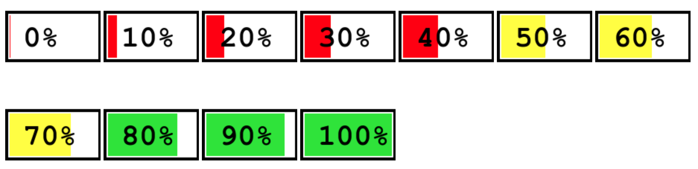
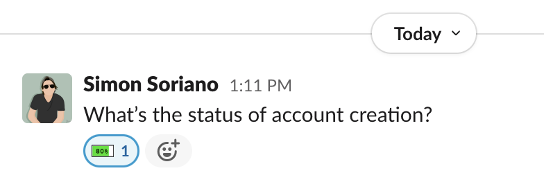

# Progress Emojis

Set of emojis to show percentage progress

## Usage

1. Download the emojis from https://github.com/simon0191/progress-emojis/releases/tag/v1.0.0
2. Upload the `.png` files as emojis
3. Use them to report progress

## Examples

### Project status summary

### Quick status report via reactions

